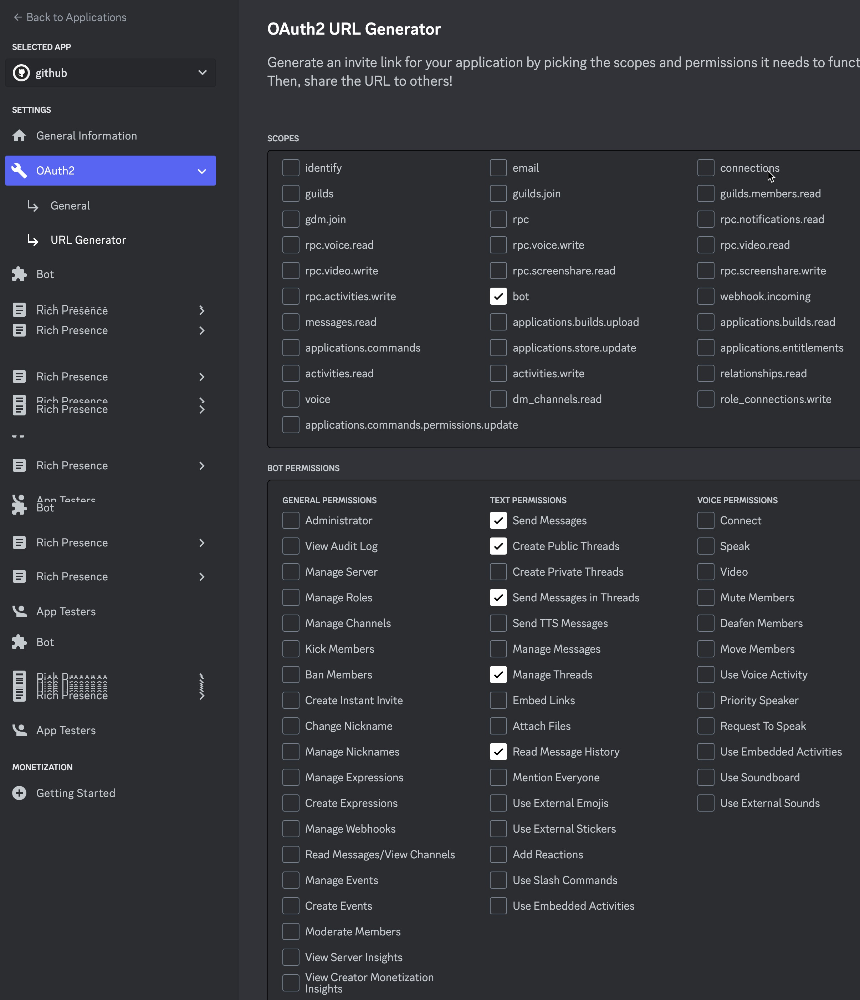

# Discord DevOps Bot

This code is implemented to help with devops operations in discord channel.

## Discord Server Setup

In order to run this bot on your Discord server you need to:

- Create an application under [Discrod Developers](https://discord.com/developers/applications) portal
- Generate a URL for your bot with access to read messages and manage and create threads

- Then use the AuthURL to give the bot access to your server
- In order to use pull request organiser, you should have a webhook setup to post the pull request related messages to a channel.

## Functionalities

### Ping Ponger

The ping ponger message processor will repond with channel id when you type `!ping` in any channel.

### Pull Reuqest Organizer

The pull request organizer message processor monitors a specific channel (CI_Channel_ID) the github pull request related messages and creates a public thread in a soecified channel (IMPLEMENTATION_CHANNEL_ID) and reposits the messages there. That way a team of developers can communicate much easier around a specific pull request.

## Running

### Locally

In order to run locally you need to set the items under appsettings.json for section `Settings` to your desired bot token and ci and implementation channel id.

If you don't know the channel ids then you can type `!ping` in any channel once the bot is running and get the channel id.

### Deployment

Deployment is based on kubernetes. Amend the `./kubernetes/secrets.yml` file to set your values. Apply the secrets to your kubernetes and then simply pull and deploy the image.

Images are available at [this dockerhub](https://hub.docker.com/repository/docker/aboo/discord-devops-bot) repository.

## Unit Testing

The project doesn't have any unit testing as it was very difficult to mock Discord classes because they all have internal constructors.
